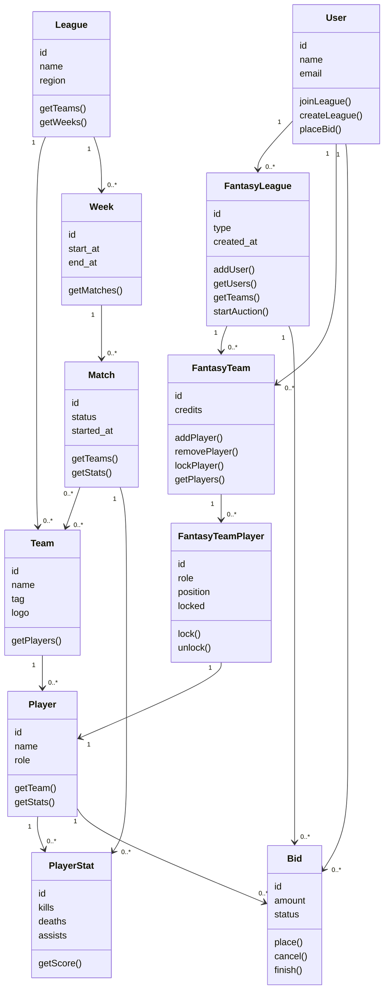

# Class Diagram

```mermaid
classDiagram

class League {
    id
    name
    region
    getTeams()
    getWeeks()
}

class Week {
    id
    start_at
    end_at
    getMatches()
}

class Match {
    id
    status
    started_at
    getTeams()
    getStats()
}

class Team {
    id
    name
    tag
    logo
    getPlayers()
}

class Player {
    id
    name
    role
    getTeam()
    getStats()
}

class PlayerStat {
    id
    kills
    deaths
    assists
    getScore()
}

class User {
    id
    name
    email
    joinLeague()
    createLeague()
    placeBid()
}

class FantasyLeague {
    id
    type
    created_at
    addUser()
    getUsers()
    getTeams()
    startAuction()
}

class FantasyTeam {
    id
    credits
    addPlayer()
    removePlayer()
    lockPlayer()
    getPlayers()
}

class FantasyTeamPlayer {
    id
    role
    position
    locked
    lock()
    unlock()
}

class Bid {
    id
    amount
    status
    place()
    cancel()
    finish()
}


League "1" --> "0..*" Team
League "1" --> "0..*" Week

Week "1" --> "0..*" Match

Match "0..*" --> "0..*" Team
Match "1" --> "0..*" PlayerStat

Team "1" --> "0..*" Player

Player "1" --> "0..*" PlayerStat

User "1" --> "0..*" FantasyLeague
User "1" --> "0..*" FantasyTeam

FantasyLeague "1" --> "0..*" FantasyTeam
FantasyLeague "1" --> "0..*" Bid

FantasyTeam "1" --> "0..*" FantasyTeamPlayer
FantasyTeamPlayer "1" --> "1" Player

User "1" --> "0..*" Bid
Player "1" --> "0..*" Bid
```
