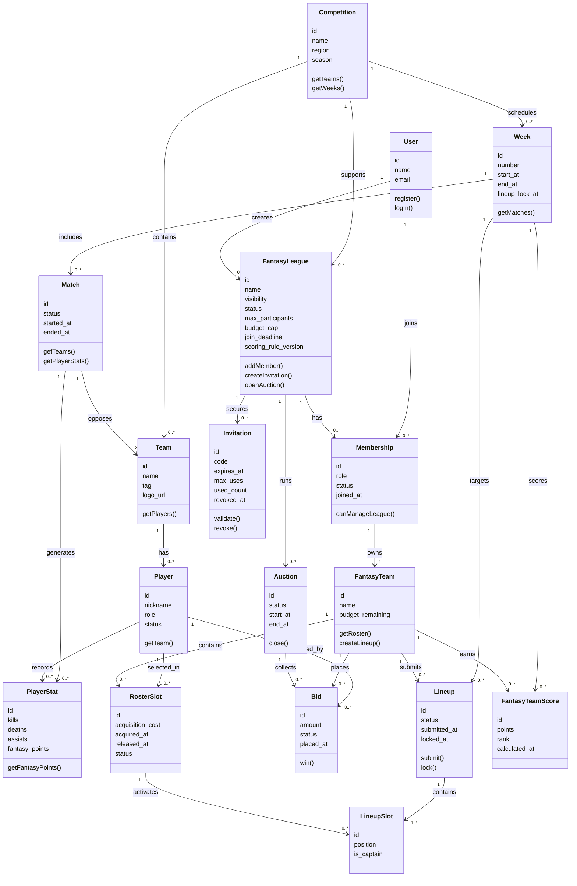

# Domain Class Diagram

## Notes

- `Membership` is the canonical participation object. It replaces the ambiguous direct participation relation between `User` and `FantasyLeague`.
- `Invitation`, `Lineup`, and `FantasyTeamScore` are explicit because the functional requirements depend on them.
- `RosterSlot` models roster ownership separately from `LineupSlot`, which models weekly activation.
