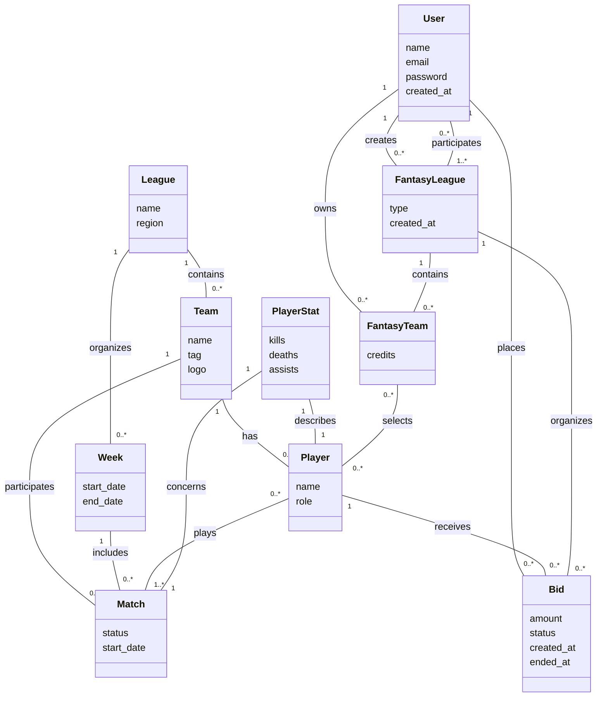

# MCD

```mermaid
classDiagram

class League {
    name
    region
}

class Team {
    name
    tag
    logo
}

class Player {
    name
    role
}

class Match {
    status
    start_date
}

class Week {
    start_date
    end_date
}

class PlayerStat {
    kills
    deaths
    assists
}

class User {
    name
    email
    password
    created_at
}

class FantasyLeague {
    type
    created_at
}

class FantasyTeam {
    credits
}

class Bid {
    amount
    status
    created_at
    ended_at
}


League "1" -- "0..*" Team : contains
League "1" -- "0..*" Week : organizes

Team "1" -- "0..*" Player : has
Team "1" -- "0..*" Match : participates

Week "1" -- "0..*" Match : includes

Player "0..*" -- "1..*" Match : plays
PlayerStat "1" -- "1" Player : describes
PlayerStat "1" -- "1" Match : concerns

User "1" -- "0..*" FantasyLeague : creates
User "0..*" -- "1..*" FantasyLeague : participates

User "1" -- "0..*" FantasyTeam : owns
FantasyLeague "1" -- "0..*" FantasyTeam : contains

FantasyTeam "0..*" -- "0..*" Player : selects

User "1" -- "0..*" Bid : places
Player "1" -- "0..*" Bid : receives
FantasyLeague "1" -- "0..*" Bid : organizes
```
