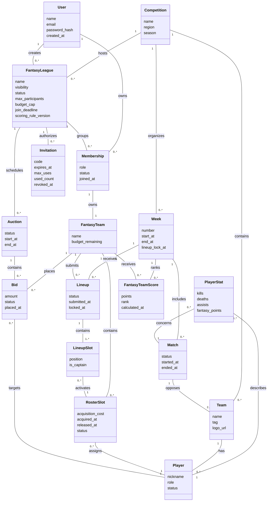

# MCD (Conceptual Data Model)

## Conceptual Constraints

- A fantasy league can be public or private, but not both.
- A membership is mandatory before a fantasy team exists.
- A private league is joined through invitations, not through the public catalog.
- A lineup is created for a specific week and activates rostered players only.
- Standings are derived from stored weekly fantasy team scores.
