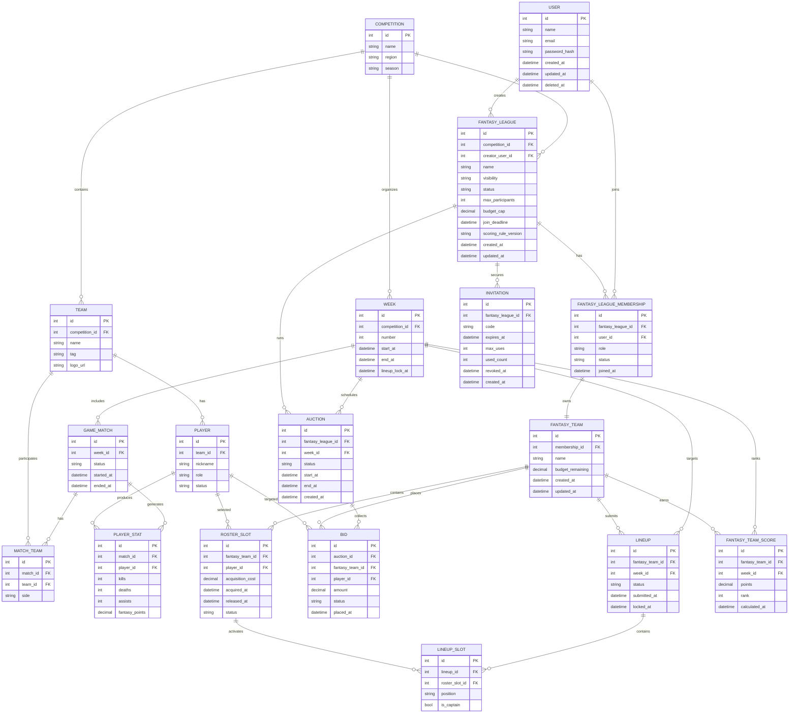

# MPD (Physical Data Model)

## Physical Constraints

- `FANTASY_LEAGUE_MEMBERSHIP (fantasy_league_id, user_id)` must be unique.
- `INVITATION.code` must be unique.
- `FANTASY_TEAM.membership_id` must be unique.
- `LINEUP (fantasy_team_id, week_id)` must be unique.
- `FANTASY_TEAM_SCORE (fantasy_team_id, week_id)` must be unique.
- `ROSTER_SLOT` should prevent two active rows for the same `(fantasy_team_id, player_id)` pair.
