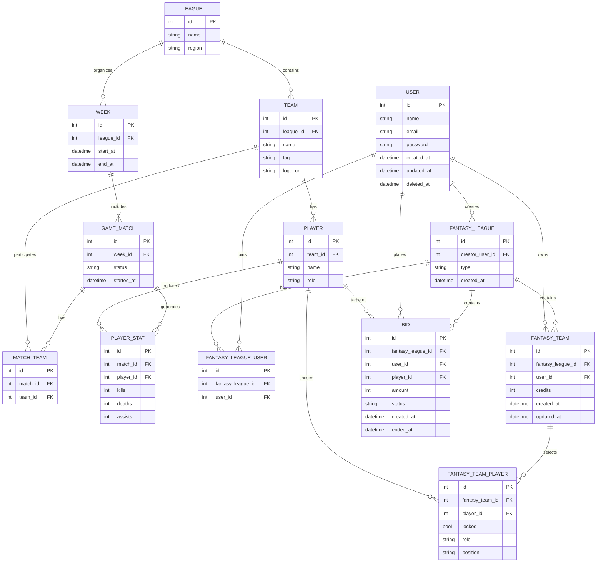

# MPD

```mermaid
erDiagram
    LEAGUE {
        int id PK
        string name
        string region
    }

    WEEK {
        int id PK
        int league_id FK
        datetime start_at
        datetime end_at
    }

    TEAM {
        int id PK
        int league_id FK
        string name
        string tag
        string logo_url
    }

    PLAYER {
        int id PK
        int team_id FK
        string name
        string role
    }

    GAME_MATCH {
        int id PK
        int week_id FK
        string status
        datetime started_at
    }

    MATCH_TEAM {
        int id PK
        int match_id FK
        int team_id FK
    }

    PLAYER_STAT {
        int id PK
        int match_id FK
        int player_id FK
        int kills
        int deaths
        int assists
    }

    USER {
        int id PK
        string name
        string email
        string password
        datetime created_at
        datetime updated_at
        datetime deleted_at
    }

    FANTASY_LEAGUE {
        int id PK
        int creator_user_id FK
        string type
        datetime created_at
    }

    FANTASY_LEAGUE_USER {
        int id PK
        int fantasy_league_id FK
        int user_id FK
    }

    FANTASY_TEAM {
        int id PK
        int fantasy_league_id FK
        int user_id FK
        int credits
        datetime created_at
        datetime updated_at
    }

    FANTASY_TEAM_PLAYER {
        int id PK
        int fantasy_team_id FK
        int player_id FK
        bool locked
        string role
        string position
    }

    BID {
        int id PK
        int fantasy_league_id FK
        int user_id FK
        int player_id FK
        int amount
        string status
        datetime created_at
        datetime ended_at
    }

    LEAGUE ||--o{ WEEK : organizes
    LEAGUE ||--o{ TEAM : contains

    WEEK ||--o{ GAME_MATCH : includes

    TEAM ||--o{ PLAYER : has
    GAME_MATCH ||--o{ MATCH_TEAM : has
    TEAM ||--o{ MATCH_TEAM : participates

    GAME_MATCH ||--o{ PLAYER_STAT : generates
    PLAYER ||--o{ PLAYER_STAT : produces

    USER ||--o{ FANTASY_LEAGUE : creates

    USER ||--o{ FANTASY_LEAGUE_USER : joins
    FANTASY_LEAGUE ||--o{ FANTASY_LEAGUE_USER : has

    FANTASY_LEAGUE ||--o{ FANTASY_TEAM : contains
    USER ||--o{ FANTASY_TEAM : owns

    FANTASY_TEAM ||--o{ FANTASY_TEAM_PLAYER : selects
    PLAYER ||--o{ FANTASY_TEAM_PLAYER : chosen

    FANTASY_LEAGUE ||--o{ BID : contains
    USER ||--o{ BID : places
    PLAYER ||--o{ BID : targeted
```
