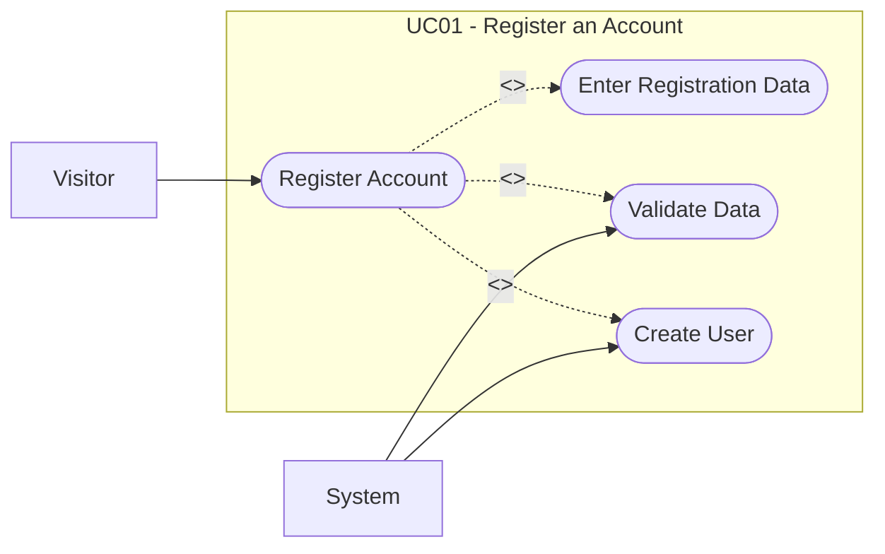

# UC01: Register an Account

## Overview

**Goal:** Allow a visitor to create a new user account.

| Field | Content |
| --- | --- |
| **ID** | UC01 |
| **Primary Actor** | Visitor |
| **Secondary Actor** | System |
| **Trigger** | The visitor selects the registration action |

## Description

The visitor provides the information required to create a user account.
The system validates the data, stores the account, and makes the user able to authenticate.

## Conditions

### Preconditions

- The visitor is not authenticated.
- The registration page is accessible.

### Postconditions (Success)

- A new user account exists.
- The email address is reserved for that account.

### Postconditions (Failure)

- No account is created.
- No partial user data is left in an inconsistent state.

## Main Scenario

1. The visitor opens the registration page.
2. The system displays the registration form.
3. The visitor enters name, email, and password.
4. The visitor submits the form.
5. The system validates the data.
6. The system verifies that the email is unique.
7. The system hashes the password.
8. The system creates the user account.
9. The system displays a success message and offers log-in access.

## Alternative Scenarios

- `A1` The email address is already used: the system refuses the registration.
- `A2` The password does not meet policy requirements: the system displays validation errors.

## Exceptions

- `E1` A technical error occurs during account creation: the system cancels the operation and logs the failure.

## Business Rules

- `BR1` Email addresses must be unique.
- `BR2` Passwords must be stored as hashes.

## Additional Information

- **Covered Features:** F01

## Schema

