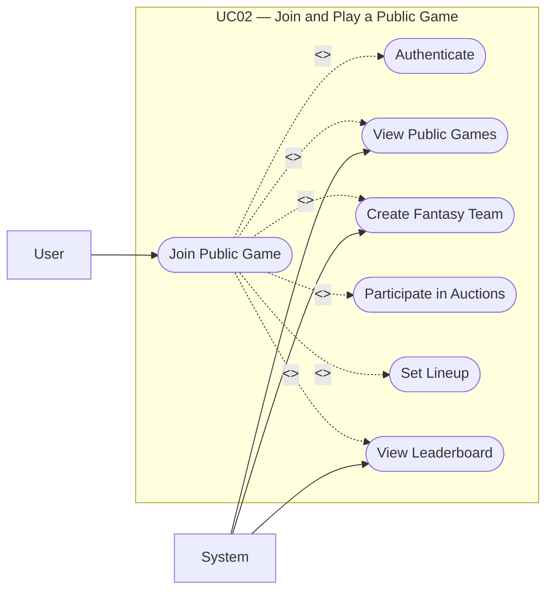

# UC02: Join and Play a Public Game

## Overview
**Goal:** Allow a user to join an existing public game and participate in the fantasy gameplay.

| Field              | Content                                                                                                                                                                                                                                                                                                                                                                                                                                                                                                                         |
| ------------------ | ------------------------------------------------------------------------------------------------------------------------------------------------------------------------------------------------------------------------------------------------------------------------------------------------------------------------------------------------------------------------------------------------------------------------------------------------------------------------------------------------------------------------------- |
| **ID**             | UC02                                                                                                                                                                                                                                                                                                                                                                                                                                                                                                                            |
| **Primary Actor**  | User                                                                                                                                                                                                                                                                                                                                                                                                                                                                                                                            |
| **Secondary Actor**| System                                                                                                                                                                                                                                                                                                                                                                                                                                                                                                                          |
| **Trigger**        | The user opens the list of public games and chooses one to join                                                                                                                                                                                                                                                                                                                                                                                                                                                                 |

---

## Description
The user views available public games, joins one, receives a fantasy team, and participates in gameplay steps such as auctions, roster management, and lineup selection.

## Conditions

### Preconditions
- The user is authenticated.
- The public game exists.
- The game still accepts participants.

### Postconditions (Success)
- The user becomes a member of the game.
- A fantasy team is associated with the user.
- The user can participate in auctions and set a lineup.

### Postconditions (Failure)
- The user does not join the game.
- No unnecessary fantasy team is created.

---

## Scenarios

### Main Scenario
1. The user views the list of public games.
2. The system displays available games.
3. The user selects a game.
4. The system displays the game details.
5. The user clicks “Join”.
6. The system checks the user’s eligibility.
7. The system records the participation.
8. The system creates the user’s fantasy team in the game.
9. The user accesses the game space.
10. The user participates in auctions.
11. The user manages their roster.
12. The user sets their lineup.
13. The system updates scores and rankings.

### Alternative Scenarios
- **A1. The game is full:** The system refuses the registration.
- **A2. The user is already a member:** The system redirects the user to the game.
- **A3. The user joins but does not yet participate in auctions:** They remain an inactive member until their next action.

### Exceptions
- **E1. Error during fantasy team creation:** The registration is cancelled to avoid an inconsistent state.

---

## Business Rules
- **BR1.** A user can join the same public game only once.
- **BR2.** Each participant has a unique fantasy team within the game.
- **BR3.** Gameplay actions depend on time windows defined by the system.

---

## Additional Information
- **UML Relationships:** `<<include>> Authenticate`; `<<include>> View public games`; `<<include>> Create a fantasy team`; `<<include>> Participate in auctions`; `<<include>> Set lineup`; `<<include>> View leaderboard`
- **Covered Features:** F04, F08, F09, F10, F11, F13, F14, F15, F16

## Schema

