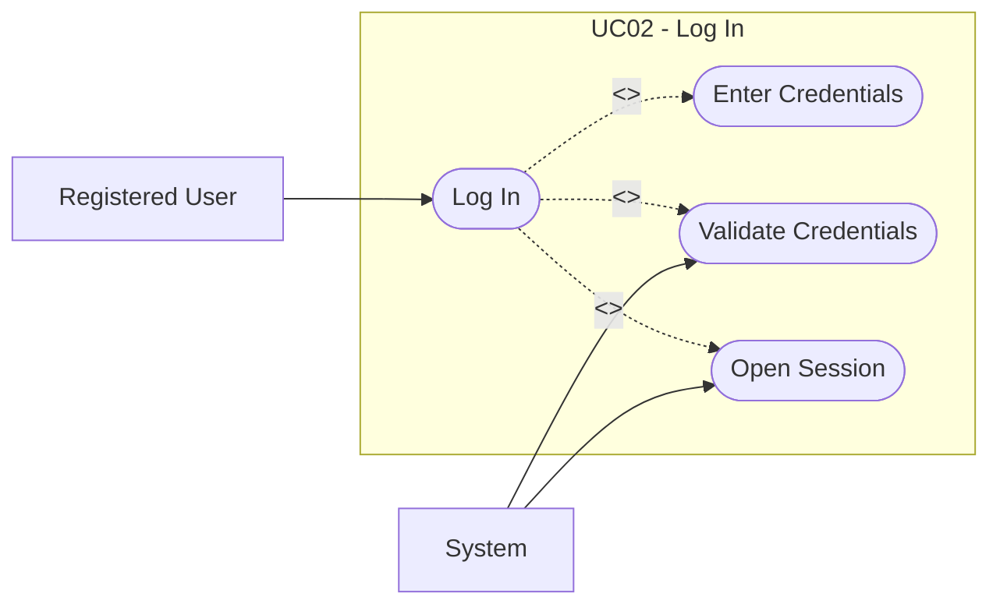

# UC02: Log In

## Overview

**Goal:** Allow a registered user to authenticate and open a session.

| Field | Content |
| --- | --- |
| **ID** | UC02 |
| **Primary Actor** | Registered User |
| **Secondary Actor** | System |
| **Trigger** | The user selects the log-in action |

## Description

The user enters their credentials. The system validates them and opens an authenticated session.

## Conditions

### Preconditions

- The user account exists.
- The log-in page is accessible.

### Postconditions (Success)

- The user is authenticated.
- An active session exists.

### Postconditions (Failure)

- The user remains unauthenticated.
- No privileged action becomes accessible.

## Main Scenario

1. The user opens the log-in page.
2. The system displays the authentication form.
3. The user enters email and password.
4. The user submits the form.
5. The system validates the credentials.
6. The system opens an authenticated session.
7. The system redirects the user to the application home or dashboard.

## Alternative Scenarios

- `A1` The credentials are invalid: the system refuses access and displays an error.
- `A2` The user account is inactive: the system refuses access.

## Exceptions

- `E1` A technical error occurs during authentication: the system cancels the operation and logs the failure.

## Business Rules

- `BR1` Only authenticated users can access protected fantasy league actions.

## Additional Information

- **Covered Features:** F02

## Schema

