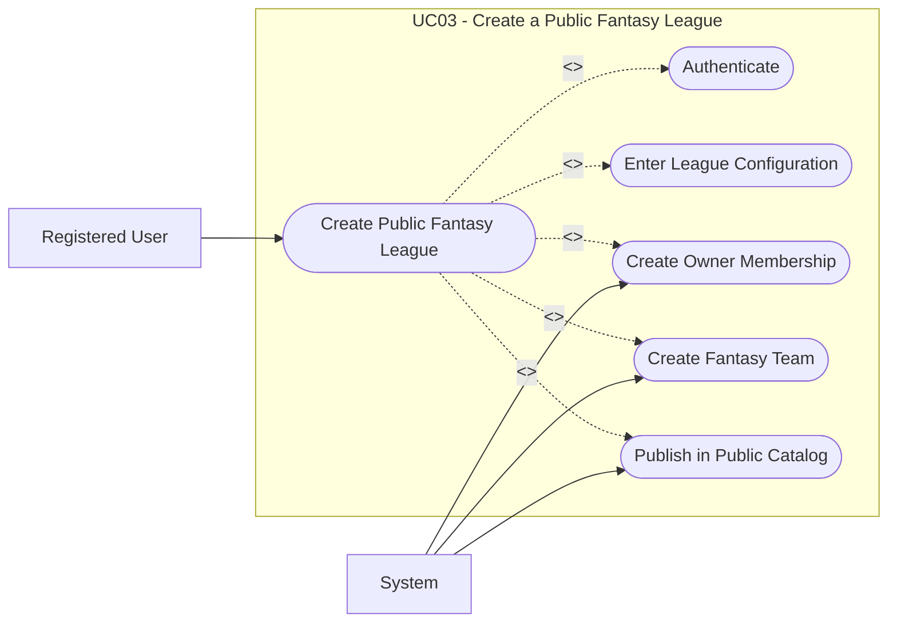

# UC03: Create a Public Fantasy League

## Overview

**Goal:** Allow a registered user to create a public fantasy league linked to a competition.

| Field | Content |
| --- | --- |
| **ID** | UC03 |
| **Primary Actor** | Registered User |
| **Secondary Actor** | System |
| **Trigger** | The user opens the fantasy league creation flow and selects public visibility |

## Description

The user creates a public fantasy league by choosing a competition and configuring the
main gameplay parameters. The system creates the fantasy league, the owner membership,
and the owner's fantasy team.

## Conditions

### Preconditions

- The user is authenticated.
- At least one competition is available for fantasy play.

### Postconditions (Success)

- A public fantasy league exists.
- The creator becomes the owner member of the fantasy league.
- The creator receives a fantasy team.
- The fantasy league appears in the public catalog.

### Postconditions (Failure)

- No fantasy league is created.
- No membership or fantasy team is created.

## Main Scenario

1. The user opens the fantasy league creation page.
2. The system displays the list of available competitions and configuration fields.
3. The user selects a competition.
4. The user enters the fantasy league name, participant cap, budget cap, join deadline, and scoring rule version.
5. The user selects `public` visibility.
6. The user submits the form.
7. The system validates the data and league rules.
8. The system creates the fantasy league.
9. The system creates the owner membership.
10. The system creates the owner's fantasy team.
11. The system publishes the fantasy league in the public catalog.
12. The system displays a confirmation message.

## Alternative Scenarios

- `A1` The submitted data is invalid: the system displays validation errors.
- `A2` The fantasy league name is already used in the same competition and season: the system refuses creation.

## Exceptions

- `E1` A technical error occurs while creating the fantasy league: the system rolls back the operation.

## Business Rules

- `BR1` A public fantasy league must be visible in the public catalog.
- `BR2` The creator automatically becomes the owner member.
- `BR3` One fantasy team is created for the owner membership.

## Additional Information

- **Covered Features:** F03, F15, F16

## Schema

