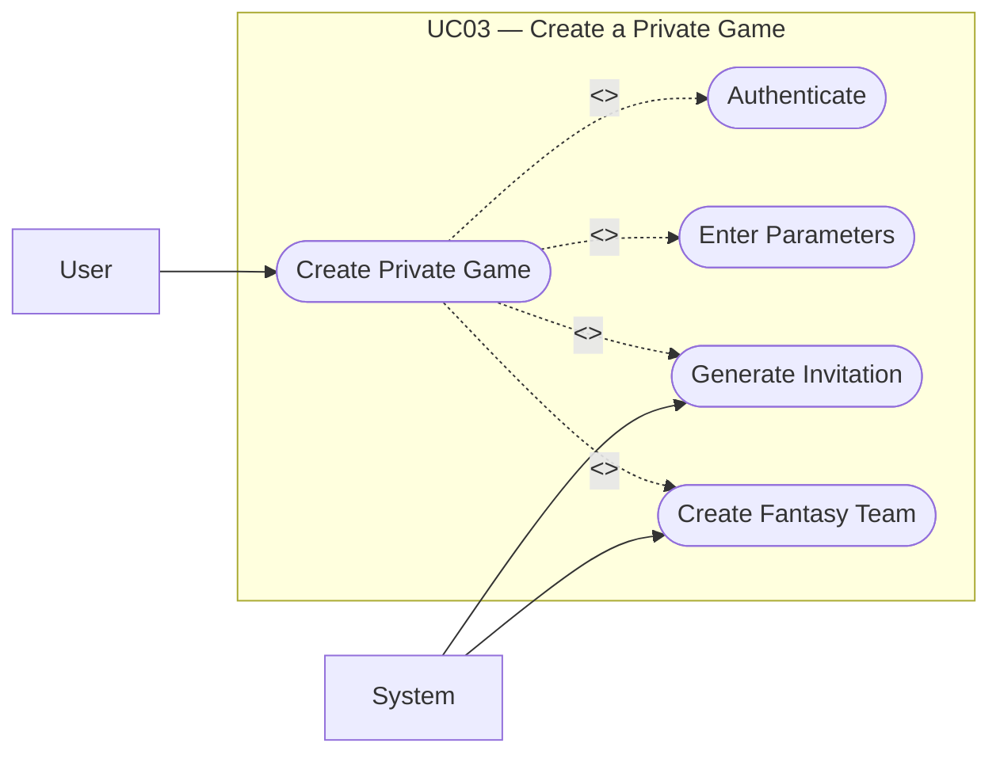

# UC03: Create a Private Game

## Overview
**Goal:** Allow a user to create a game accessible only by invitation.

| Field              | Content                                                                                                                                                                                                                                                                                                                                                                                                                                                                                  |
| ------------------ | ---------------------------------------------------------------------------------------------------------------------------------------------------------------------------------------------------------------------------------------------------------------------------------------------------------------------------------------------------------------------------------------------------------------------------------------------------------------------------------------- |
| **ID**             | UC03                                                                                                                                                                                                                                                                                                                                                                                                                                                                                     |
| **Primary Actor**  | User                                                                                                                                                                                                                                                                                                                                                                                                                                                                                     |
| **Secondary Actor**| System                                                                                                                                                                                                                                                                                                                                                                                                                                                                                   |
| **Trigger**        | The user clicks “Create Game” and selects the private mode                                                                                                                                                                                                                                                                                                                                                                                                                               |

---

## Description
The user creates a private game. The system generates an invitation code or link for future participants.

## Conditions

### Preconditions
- The user is authenticated.

### Postconditions (Success)
- The private game is created.
- The user is registered as creator and first participant.
- A fantasy team is associated with the user.
- An invitation code or link is generated.

### Postconditions (Failure)
- No private game is created.
- No private access is generated.

---

## Scenarios

### Main Scenario
1. The user opens the creation page.
2. The system displays the form.
3. The user selects the “private” type.
4. The user enters the required parameters.
5. The user submits the form.
6. The system validates the data.
7. The system creates the private game.
8. The system adds the creator as a participant.
9. The system automatically creates the creator’s fantasy team.
10. The system generates an invitation code or link.
11. The system displays the sharing information.

### Alternative Scenarios
- **A1. Incomplete parameters:** The system refuses the submission.
- **A2. The creator chooses to limit the number of participants:** The system records this constraint if it exists.

### Exceptions
- **E1. Failure to generate the invitation code:** The creation is cancelled or marked as unpublished.

---

## Business Rules
- **BR1.** A private game does not appear in the public game list.
- **BR2.** Access to a private game requires a valid invitation.
- **BR3.** The creator automatically becomes a member of the game.
- **BR4.** An initial fantasy team is created for the creator.

---

## Additional Information
- **UML Relationships:** `<<include>> Authenticate`; `<<include>> Enter parameters`; `<<include>> Generate invitation`; `<<include>> Create a fantasy team`
- **Covered Features:** F05, F06, F08, F16

## Schema

