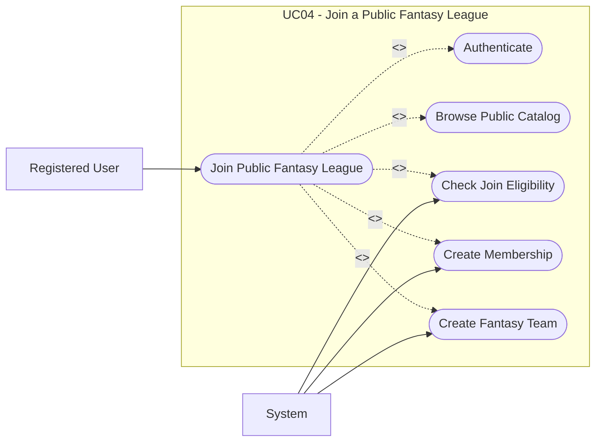

# UC04: Join a Public Fantasy League

## Overview

**Goal:** Allow a registered user to join an open public fantasy league.

| Field | Content |
| --- | --- |
| **ID** | UC04 |
| **Primary Actor** | Registered User |
| **Secondary Actor** | System |
| **Trigger** | The user selects a fantasy league from the public catalog |

## Description

The user consults the public catalog, joins a public fantasy league, and receives a
membership and a fantasy team if the league still accepts participants.

## Conditions

### Preconditions

- The user is authenticated.
- The fantasy league is public.
- The join deadline has not passed.

### Postconditions (Success)

- The user becomes an active member of the fantasy league.
- The user receives a fantasy team.

### Postconditions (Failure)

- The user does not join the fantasy league.
- No fantasy team is created.

## Main Scenario

1. The user opens the public fantasy league catalog.
2. The system displays the available public fantasy leagues.
3. The user selects one fantasy league.
4. The system displays its configuration and current availability.
5. The user selects `Join`.
6. The system checks visibility, participant cap, deadline, and duplicate membership.
7. The system creates the membership.
8. The system creates the user's fantasy team.
9. The system grants access to the fantasy league workspace.

## Alternative Scenarios

- `A1` The fantasy league is full: the system refuses the join request.
- `A2` The user is already a member: the system redirects the user to the existing workspace.
- `A3` The join deadline has passed: the system refuses the join request.

## Exceptions

- `E1` A technical error occurs while creating the membership or fantasy team: the system rolls back the operation.

## Business Rules

- `BR1` A user can join the same fantasy league only once.
- `BR2` Each active membership owns exactly one fantasy team.

## Additional Information

- **Covered Features:** F04, F15, F16

## Schema

