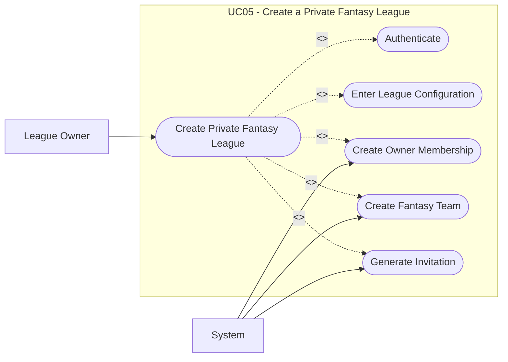

# UC05: Create a Private Fantasy League

## Overview

**Goal:** Allow a league owner to create a private fantasy league and generate invitations.

| Field | Content |
| --- | --- |
| **ID** | UC05 |
| **Primary Actor** | League Owner |
| **Secondary Actor** | System |
| **Trigger** | The owner opens the fantasy league creation flow and selects private visibility |

## Description

The owner creates a private fantasy league, configures its rules, and receives at least
one active invitation that can be shared with future participants.

## Conditions

### Preconditions

- The owner is authenticated.
- At least one competition is available for fantasy play.

### Postconditions (Success)

- A private fantasy league exists.
- The creator becomes the owner member.
- The creator receives a fantasy team.
- At least one invitation exists for the fantasy league.

### Postconditions (Failure)

- No private fantasy league is created.
- No invitation is created.

## Main Scenario

1. The owner opens the fantasy league creation page.
2. The system displays the list of available competitions and configuration fields.
3. The owner selects a competition.
4. The owner enters the fantasy league name, participant cap, budget cap, join deadline, and scoring rule version.
5. The owner selects `private` visibility.
6. The owner optionally sets invitation expiry and usage limits.
7. The owner submits the form.
8. The system validates the configuration.
9. The system creates the fantasy league.
10. The system creates the owner membership.
11. The system creates the owner's fantasy team.
12. The system generates an invitation code or link.
13. The system displays the private access information.

## Alternative Scenarios

- `A1` The owner omits a required field: the system displays validation errors.
- `A2` The owner requests a participant cap lower than the current member count policy allows: the system refuses creation.

## Exceptions

- `E1` Invitation generation fails after league creation starts: the system rolls back the operation.

## Business Rules

- `BR1` A private fantasy league must not be listed in the public catalog.
- `BR2` Invitation codes must be unique.
- `BR3` The owner automatically becomes the first active member.

## Additional Information

- **Covered Features:** F05, F06, F15, F16

## Schema

