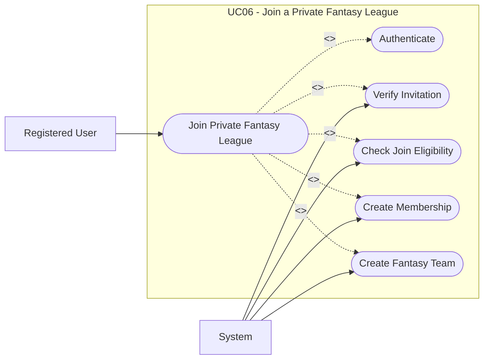

# UC06: Join a Private Fantasy League

## Overview

**Goal:** Allow a registered user to join a private fantasy league through a valid invitation.

| Field | Content |
| --- | --- |
| **ID** | UC06 |
| **Primary Actor** | Registered User |
| **Secondary Actor** | System |
| **Trigger** | The user opens an invitation link or enters an invitation code |

## Description

The user presents an invitation. The system validates it, checks join eligibility,
creates the membership, and creates the user's fantasy team.

## Conditions

### Preconditions

- The user is authenticated.
- The target fantasy league is private.
- The invitation code or link exists.

### Postconditions (Success)

- The user becomes an active member of the private fantasy league.
- The user receives a fantasy team.
- The invitation usage count is updated when applicable.

### Postconditions (Failure)

- The user does not join the fantasy league.
- No fantasy team is created.

## Main Scenario

1. The user opens an invitation link or accesses the private join form.
2. The system requests authentication if needed.
3. The user provides the invitation code when required.
4. The system checks that the invitation exists, is not revoked, is not expired, and still has available uses.
5. The system checks that the user is not already a member.
6. The system checks the participant cap and join deadline.
7. The system creates the membership.
8. The system creates the user's fantasy team.
9. The system updates the invitation usage count.
10. The system grants access to the fantasy league workspace.

## Alternative Scenarios

- `A1` The invitation is invalid: the system refuses access.
- `A2` The invitation is expired or revoked: the system refuses access.
- `A3` The fantasy league is full or closed: the system refuses access.
- `A4` The user is already a member: the system redirects the user to the existing workspace.

## Exceptions

- `E1` A technical error occurs while creating the membership or fantasy team: the system rolls back the operation.

## Business Rules

- `BR1` A private fantasy league requires a valid invitation.
- `BR2` Invitation usage must never exceed the configured maximum.
- `BR3` A user can join the same private fantasy league only once.

## Additional Information

- **Covered Features:** F07, F15, F16

## Schema

