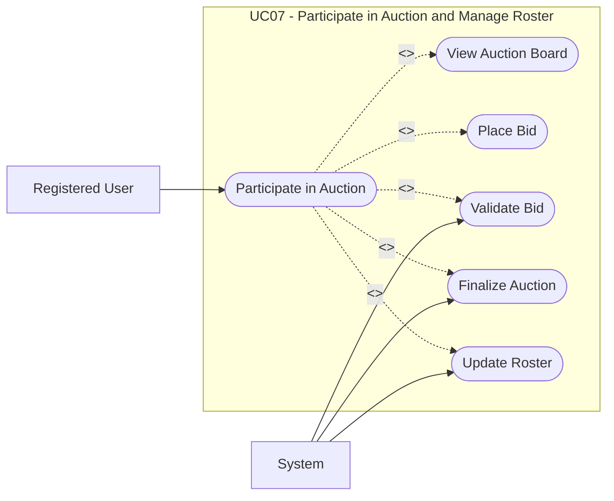

# UC07: Participate in Auction and Manage Roster

## Overview

**Goal:** Allow a member to bid on players and build a valid roster.

| Field | Content |
| --- | --- |
| **ID** | UC07 |
| **Primary Actor** | Registered User |
| **Secondary Actor** | System |
| **Trigger** | The user opens an active auction in a fantasy league they joined |

## Description

The member consults the active auction, places bids on available players, and receives
roster updates when bids are won and finalized.

## Conditions

### Preconditions

- The user is authenticated.
- The user has an active membership and fantasy team.
- An auction is open in the fantasy league.

### Postconditions (Success)

- The bid is recorded or updated.
- Winning bids result in roster ownership and budget updates.

### Postconditions (Failure)

- No invalid bid is recorded.
- The roster remains unchanged when the bid fails.

## Main Scenario

1. The user opens the auction board.
2. The system displays the available players, current prices, auction timing, and the fantasy team's remaining budget.
3. The user selects a player and enters a bid amount.
4. The user submits the bid.
5. The system validates auction status, player availability, and budget constraints.
6. The system records the bid.
7. When the auction closes, the system resolves the winning bid.
8. The system updates the winning fantasy team's budget.
9. The system creates or updates the roster ownership for the player.
10. The system displays the updated roster to the user.

## Alternative Scenarios

- `A1` The bid amount exceeds the remaining budget: the system refuses the bid.
- `A2` Another fantasy team places a better bid before closure: the user is outbid.
- `A3` The player is already rostered in the same fantasy league: the system refuses the bid.

## Exceptions

- `E1` A technical error occurs while finalizing the auction: the system keeps the auction in a recoverable state and logs the failure.

## Business Rules

- `BR1` A player can belong to at most one active roster in the same fantasy league.
- `BR2` A bid must not reduce the fantasy team budget below zero.
- `BR3` Only the final winning bid updates roster ownership.

## Additional Information

- **Covered Features:** F08, F09, F16

## Schema

