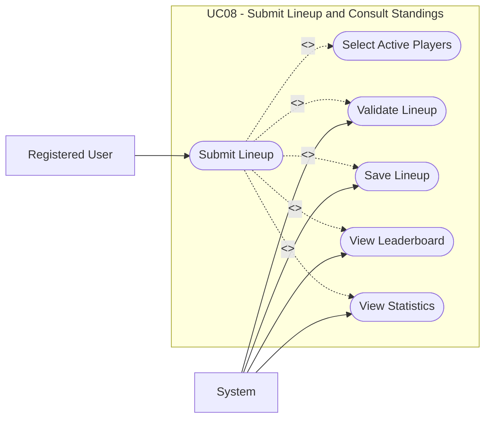

# UC08: Submit Lineup and Consult Standings

## Overview

**Goal:** Allow a member to submit a weekly lineup and consult rankings and statistics.

| Field | Content |
| --- | --- |
| **ID** | UC08 |
| **Primary Actor** | Registered User |
| **Secondary Actor** | System |
| **Trigger** | The user opens the weekly fantasy league workspace |

## Description

The member selects active rostered players for a specific week, submits the lineup before
the lock deadline, and consults standings and detailed statistics once scores are available.

## Conditions

### Preconditions

- The user is authenticated.
- The user has an active membership and fantasy team.
- The target week exists in the linked competition.

### Postconditions (Success)

- A valid lineup is stored or updated for the selected week.
- The user can consult the latest leaderboard and statistics.

### Postconditions (Failure)

- No invalid lineup is stored.
- Standings remain read-only outputs.

## Main Scenario

1. The user opens the fantasy league workspace for a given week.
2. The system displays the roster, the lineup lock deadline, and the latest standings.
3. The user selects the active players and positions for the week.
4. The user submits the lineup.
5. The system verifies roster ownership, role constraints, and deadline compliance.
6. The system stores or updates the lineup.
7. The user opens the leaderboard view.
8. The system displays the latest fantasy team scores and ranking.
9. The user opens a statistics view.
10. The system displays real match statistics and fantasy point details for the selected players or teams.

## Alternative Scenarios

- `A1` The lineup is incomplete or invalid: the system displays validation errors.
- `A2` The lock deadline has passed: the system displays the lineup in read-only mode.
- `A3` No score has been calculated yet for the week: the system displays the most recent available ranking and a pending status for the week.

## Exceptions

- `E1` A technical error occurs during lineup submission: the system keeps the previous saved state.

## Business Rules

- `BR1` A fantasy team can submit only one lineup per week.
- `BR2` A lineup can contain only currently rostered players.
- `BR3` A locked lineup cannot be modified.
- `BR4` Rankings must be based on stored fantasy team scores, not ad hoc calculations in the UI.

## Additional Information

- **Covered Features:** F10, F13, F14

## Schema

