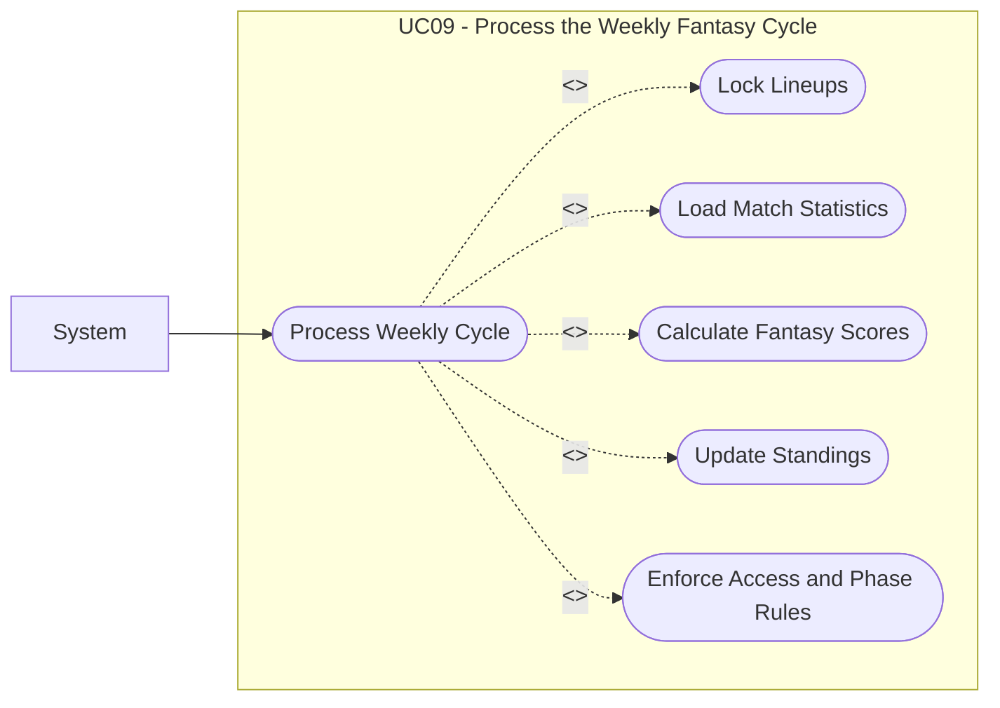

# UC09: Process the Weekly Fantasy Cycle

## Overview

**Goal:** Allow the system to lock lineups, calculate scores, and update standings.

| Field | Content |
| --- | --- |
| **ID** | UC09 |
| **Primary Actor** | System |
| **Secondary Actor** | None |
| **Trigger** | A lineup lock deadline or score calculation event is reached |

## Description

The system executes the weekly automated flow: it locks lineups at the configured
deadline, processes real match statistics, calculates fantasy points, persists weekly
team scores, and updates the leaderboard and access state.

## Conditions

### Preconditions

- A week exists for the linked competition.
- One or more fantasy leagues are active on that competition.
- Match statistics are available when score calculation starts.

### Postconditions (Success)

- Eligible lineups are locked.
- Fantasy scores are calculated and persisted.
- Weekly standings are updated.
- Read/write permissions match the current league phase.

### Postconditions (Failure)

- The system keeps the latest consistent score snapshot.
- Incomplete calculations are not exposed as final standings.

## Main Scenario

1. The system detects that the lineup lock deadline has been reached for a week.
2. The system locks all submitted lineups for that week.
3. The system prevents further lineup modification.
4. The system imports or reads the relevant match statistics.
5. The system calculates fantasy points according to the league scoring rule version.
6. The system aggregates points per fantasy team for the week.
7. The system persists fantasy team scores.
8. The system calculates ranking positions inside each fantasy league.
9. The system updates the leaderboard views and read permissions for the week.

## Alternative Scenarios

- `A1` Statistics are only partially available: the system keeps the week in a pending state.
- `A2` A fantasy league has no submitted lineup for the week: the system calculates a zero or default score according to business rules.

## Exceptions

- `E1` A technical error occurs during score calculation: the system aborts publication of the new standings and preserves the previous consistent snapshot.

## Business Rules

- `BR1` Locked lineups are immutable.
- `BR2` Score calculation uses the configured scoring rule version of each fantasy league.
- `BR3` Published standings must come from persisted weekly team scores.

## Additional Information

- **Covered Features:** F11, F12, F15, F16

## Schema

